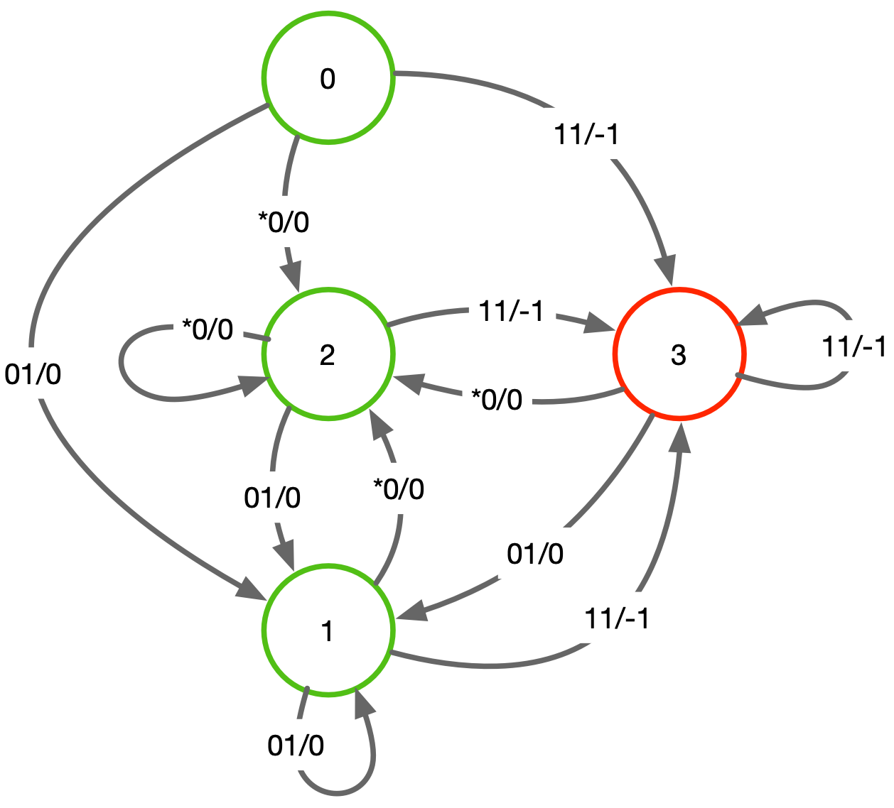

# Minimax Concurrent Play Game

Usages:

```
python -u concurrent.py -h
usage: concurrent.py [-h] [-g G] [-e E] [-s S]

optional arguments:
  -h, --help  show this help message and exit
  -g G        Game type
  -e E        Max Episodes
  -s S        Max Steps  
 ```
  
Currently available games and game codes:
 ```
    Sg  - SampleGame
    Sg2 - SampleGame2
    Sf1 - SafetyGame1
    Sf2 - SafetyGame2
    T   - Temperature
 ```
Where SafetyGame1 and Safety Game2 are identical games. The difference is, for SafetyGame1, the state machine is hardcoded in the python script whereas, for SafetyGame2, the state machine is coded in an AIGER model that is simulating the state machine as a black box. To run SafetyGame2, see below discussion on playing AIGER formatted games.
 
 A typical invocation:
 ```
 python -u turnBased.py -g Sf1
 ```
The `-u` option is recommended to override python output buffering

The output will provide the best move for both players and then play 10 moves based on thost strategies. The play is displayed as a binary value where the upper bit is the max player's move while the lower bit is the min player's. A typical output would look like:
```
SafetyGame1
Max Episodes = 10000
Max Steps = 100
....................................................................................................

Optimal Policy: 
State:   0 Max Action:   1 Min Action:   0
State:   1 Max Action:   1 Min Action:   0
State:   2 Max Action:   1 Min Action:   0
State:   3 Max Action:   1 Min Action:   1

Quick Play
  0: State:  0 Play: 10 Reward:  0 New State:  2
  1: State:  2 Play: 10 Reward:  0 New State:  2
  2: State:  2 Play: 10 Reward:  0 New State:  2
  3: State:  2 Play: 10 Reward:  0 New State:  2
  4: State:  2 Play: 10 Reward:  0 New State:  2
  5: State:  2 Play: 10 Reward:  0 New State:  2
  6: State:  2 Play: 10 Reward:  0 New State:  2
  7: State:  2 Play: 10 Reward:  0 New State:  2
  8: State:  2 Play: 10 Reward:  0 New State:  2
  9: State:  2 Play: 10 Reward:  0 New State:  2
  ```
# The Concurrent Games



# Playing AIGER Formatted Games
AIGER formatted circuits can be treated as concurrent games by combining `concurrent.py` with `aigsim.py`. To set the Sf2 game up, copy the simulator `aigsim.py` and model 'aigTestSMV2.aag.txt` into the same directory as `concurrent.py`. 
