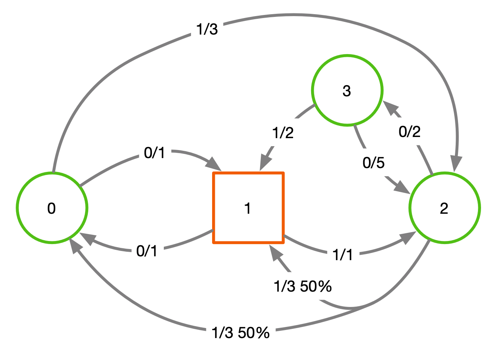
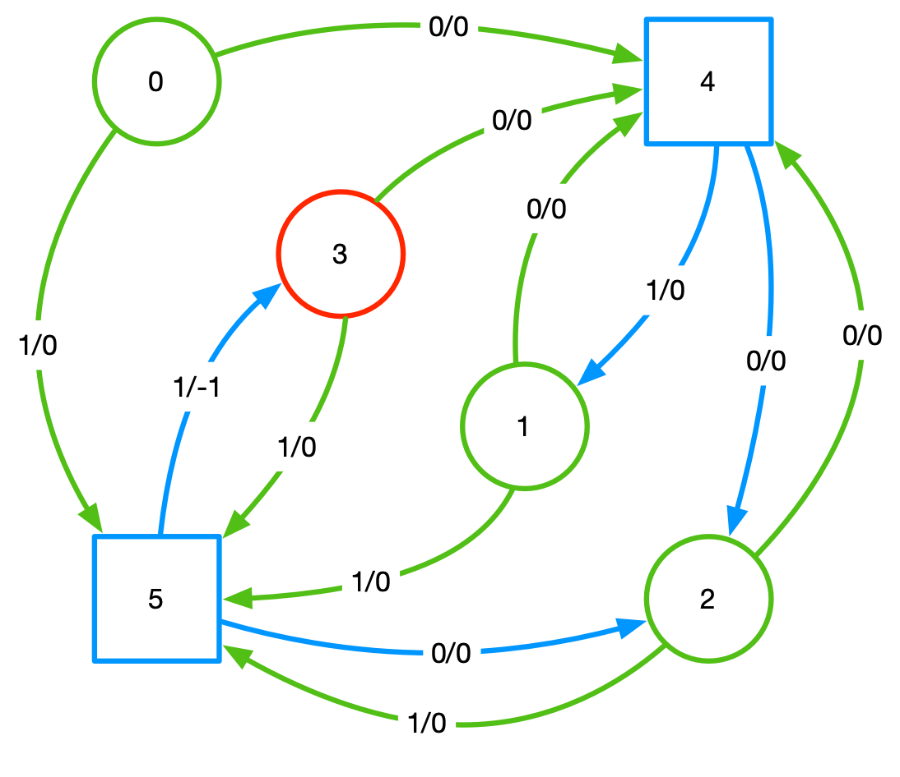

# Minimax Turn Based Game

Usages:

```
python -u turnBased.py -h
usage: turnBased.py [-h] [-g G]

optional arguments:
  -h, --help  show this help message and exit
  -g G        Game Type
  ```
  
 Currently available games:
 ```
    SampleGame
    SafetyGame1
 ```
 
 A typical invocation:
 ```
 python -u turnBased.py -g SampleGame
 ```
 The `-u` option is recommended to override python output buffering

# The Concurrent Games

<br>
**Sample Game1**<br><br>
<br>
**Safety Game1**<br>
This is the concurrent SafetyGame1 converted to a turn based game<br><br>
